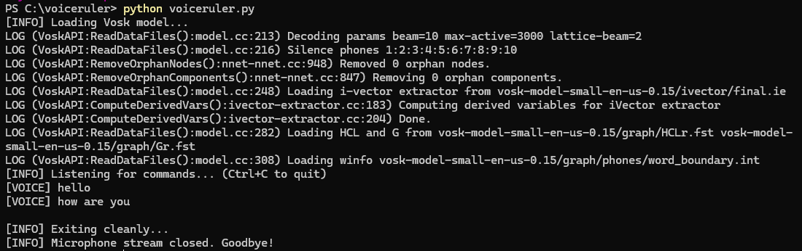

# voiceruler
This tool converts your voice commands into typed text in any active window (games, chat, Notepad, etc.) using **offline speech recognition** with Vosk.

Handy for video games with text-based controls. The tool uses a special delay mechanism to ensure that each new command first opens the game's input field, and only then types the full text into it.

## Showcase

https://github.com/user-attachments/assets/f4043da5-456a-4a34-8e5b-fb6b18611f6d

## Installation

1. [Download Python 3.10+](https://www.python.org/downloads/). Ensure pip is available.
2. Install dependencies:  
    ```cmd
    pip install vosk pyautogui keyboard sounddevice
    ```
3. Download an offline [Vosk model](https://alphacephei.com/vosk/models). Recommended version: `vosk-model-small-en-us-0.15` (~50 MB). Extract it to a convenient folder.
4. Download the `voiceruler.py` script from this repo.
5. Update the script with your Vosk model path, e.g.:  
    ```text
    MODEL_PATH = r"C:\vosk-model-small-en-us-0.15"
    ```

## Usage

1. Open your preferrable command-line interface and run the script:
    ```cmd
    python voiceruler.py
    ```
    Make sure to specify the full path to the script relatively to the current folder.
2. Speak to verify that the command line accepts input. It will use your OS-default mic.
   
4. Launch the game or another app and try controlling it with voice.

To stop the script, press `Ctrl+C` while in the command line.

## Contribution

If you are a Python developer (I am not — I just wanted to play a game without much typing), please feel free to send PRs and improve the noob code.
